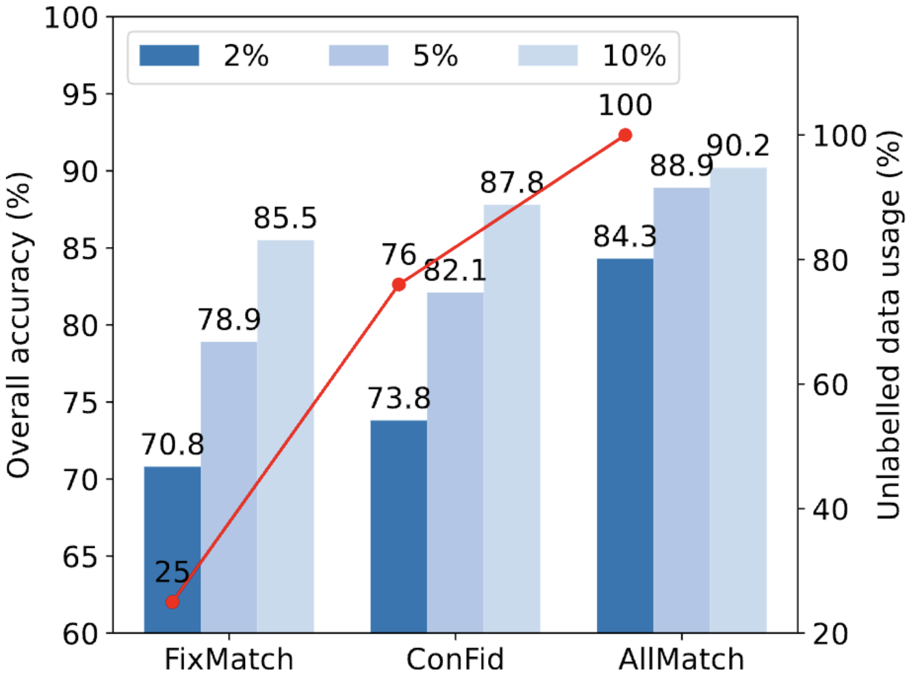

## Improving 3D Semi-supervised Learning by Effectively Utilizing All Unlabelled Data
This is a Pytorch implementation of AllMatch.

[Sneha Paul](https://snehaputul.github.io/)<sup>1</sup>\* , [Zachary Patterson]([https://scholar.google.com/citations?user=oMvFn0wAAAAJ&hl=en)](https://scholar.google.com/citations?user=FBtlDAMAAAAJ&hl=en&oi=ao)<sup>1</sup>, and [Nizar Bouguila]([https://scholar.google.com/citations?user=UeltiQ4AAAAJ&hl=en](https://scholar.google.com/citations?user=JF6jrN8AAAAJ&hl=en&oi=ao)<sup> 1</sup>

<sup>1</sup>  CIISE, Concordia University

(*) corresponding author

## 📣 News

- **[01/July/2024]** 🎉 Our paper AllMatch is accepted by **ECCV 2024**! 🥳🥳


## Abstract

Semi-supervised learning (SSL) has shown its effectiveness in learning effective 3D representation from a small amount of labelled data while utilizing large unlabelled data. Traditional semi-supervised approaches rely on the fundamental concept of predicting pseudo-labels for unlabelled data and incorporating them into the learning process. However, we identify that the existing methods do not fully utilize all the unlabelled samples and consequently limit their potential performance. To address this issue, we propose AllMatch, a novel SSL-based 3D classification framework that effectively utilizes all the unlabelled samples. AllMatch comprises three modules: (1) an adaptive hard augmentation module that applies relatively hard augmentations to the high-confident unlabelled samples with lower loss values, thereby enhancing the contribution of such samples, (2) an inverse learning module that further improves the utilization of unlabelled data by learning what not to learn, and (3) a contrastive learning module that ensures learning from all the samples in both supervised and unsupervised settings. Comprehensive experiments on two popular 3D datasets demonstrate a performance improvement of up to 11.2\% with 1\% labelled data, surpassing the SOTA by a significant margin. Furthermore, AllMatch exhibits its efficiency in effectively leveraging all the unlabelled data, demonstrated by the fact that only 10\% of labelled data reaches nearly the same performance as fully-supervised learning with all labelled data.


## Overview

<div  align="center">    
 
</div>


### Requirements
python >= 3.7

pytorch >= 1.6

h5py

scikit-learn

### Datasets

ModelNet40 (https://modelnet.cs.princeton.edu/)
ScanObjectNN (https://hkust-vgd.github.io/scanobjectnn/)


### Example training and testing
```shell script
# train
python main.py --exp_name train --perceptange 2 --num_points 1024 --dataset ModelNet40 --batch_size 24 --ema_m 0.99 --unlabeled_ratio 5 --epochs 350 --masking_epoch 50 --lr 7.5e-05 --fake_epoch 5 --u_lambda 1.0 --lambda_ce 1 --unsupcon_lambda 0.2 --supcon_lambda 0 --nl_lambda 1
```


## Acknowledgements
This project is based on FixMatch ([paper](https://proceedings.neurips.cc/paper/2020/hash/06964dce9addb1c5cb5d6e3d9838f733-Abstract.html)), FlexMatch ([paper](https://proceedings.neurips.cc/paper/2021/hash/995693c15f439e3d189b06e89d145dd5-Abstract.html)), FullMatch([paper](https://arxiv.org/abs/2303.11066)), ConFid ([paper](https://arxiv.org/abs/2210.10138)). Thanks for their excellent works.


